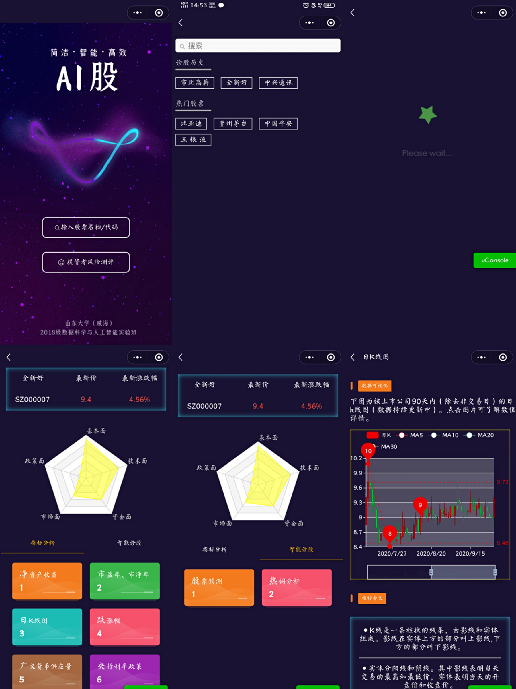
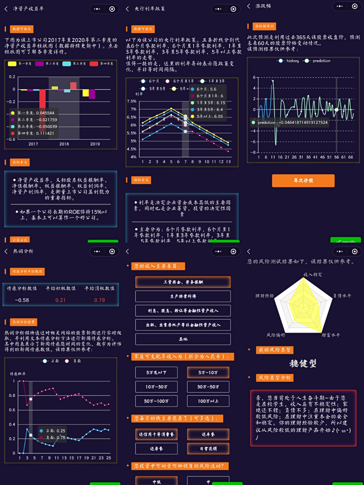
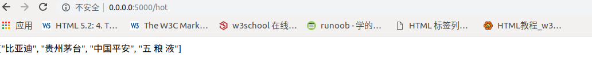

[TOC]


# “AI股” 微信小程序使用说明、开发过程及原理介绍

> 团队成员：刘润迪  尹爱华  王萦

## 一、产品介绍

### 1. 界面展示



>  注：从左往右从上往下依次为——首页、导航页、等待页、主页面1、主页面2、日K线图



> 注：从左往右从上往下依次为——净资产收益率、央行收益率、股票预测、热词分析、投资者风险测评、风测报告

### 2. 使用说明及功能介绍

#### 2.1 使用说明

用户进入”AI股“微信小程序，显示首页界面，可以选择进入股票分析或者投资者风险测评

+ 净资产收、央行收益率、益率相应热门股票或股票历史或通过搜索框搜索制定股票，进入股票分析页面
  + 股票分析页面中，可以查看股票的基本指标实时情况。点击相关按钮可以查看详细信息和图表，图标下附有专业名词解释，方便新手用户进行了解；
  + 智能诊股页面中，点击相关按钮可以查看智能AI诊股详细信息和图表
+ 进入投资者风险测评后，用户完成下方的十道题目，系统根据答题情况会个性化的生成一份风险评估报告

#### 2.2 指标显示与分析

用户只需要填入需要预测的股票名称或代码，即可实时查看该股票目前的最新价和最新涨幅；点击下方相应的按钮，可以实时查看该股票目前的最新分析数据和图表。

#### 2.3 股票预测

用户只需要填入需要预测的股票名称或代码，点击“股票预测”按钮，稍等片刻就可以查看该股票未来60天股价涨跌幅的预测情况。

#### 2.4 投资者风险测评

用户点击首页中的”投资者风险测评“按钮，完成包括职业、收入、理财经验、理财风险接受能力等在内的十个问题，可以获得一份风险测评等级报告。报告中包括一个五维雷达图、我的风险类型等级和风险类型分析建议三部分，可以为使用者提供一定的风险投入分析。

### 3. 亮点与创新性

+ 实现股票数据的实时更新。考虑到股市每分每秒的变动性，我们可以对股价数据进行实时爬取和图表绘制，从而为使用者提供第一手信息；
+ 图表的简洁美观。选取最能够反映股市变动和股价情况的指标进行分析和图表绘制，以最简洁直观的方式的用户提供最智能的小程序体验；
+ 附录专业术语名词解释。每个专业名词下面附有对应的名词解释以及经验分析，更有利于为新手股民提供参考性意见；
+ 股价预测的智能化与实时化。根据最近股票数据，利用LSTM模型进行估价预测和涨幅预测，经测试发现：利用历史数据进行预测的准确率可以到到90%以上；
+ 提供估价新闻的舆论情感分析。力求多维度对股价变动提供分析建议，从新闻和舆论角度出发，利用百度云AI情感分析API，对最新的股票新闻进行积极与消极的情感分析；
+ 设立投资者风险测评栏目，为用户提供现阶段的风控分析报告。

## 二、开发过程及开发原理

### 1. 股票搜索——获取前4支热门股票名称

股票搜索界面可以获取到现阶段的四支热门股票，实现快捷进入诊股。代码如下：

```python
####返回4个热门股票名称
@app.route('/hot', methods=['GET', 'POST'])
def Hot():
    rep1 = requests.get('https://api.doctorxiong.club/v1/stock/hot')
    rep1.encoding = 'utf-8'
    hot=[]
    hot.append(rep1.json()['data'][0]['name'])
    hot.append(rep1.json()['data'][1]['name'])
    hot.append(rep1.json()['data'][2]['name'])
    hot.append(rep1.json()['data'][3]['name'])
    return json.dumps(hot,ensure_ascii=False)
```

结果示例：



### 2. 指标分析

#### 2.1 基本面

##### 2.1.1 宏观经济分析

对大环境的经济运营状况和经济政策的分析

##### 2.1.2 行业分析

对股票所在产业和区域的分析

##### 2.1.3 公司分析

###### 净资产收益率

ROE，即Rate of Return on Common Stockholders' Equity，中文名称为：净资产收益率，又称股东权益报酬率、净值报酬率、权益报酬率、权益利润率、净资产利润率，是衡量上市公司盈利能力的重要指标。

在《巴菲特致股东的信》中，巴菲特表达了一个想法：衡量一个公司是否优秀，如果只用一个财务指标，那就是净资产收益率（ROE）。如果一个公司长期的ROE保持15%以上，基本上可以算作一个好公司。
$$
净资产收益率 = \frac{净利润}{净资产}
$$

1. 净资产收益率越大，一般该公司表示盈利能力越大；
2. 在使用净资产收益时，要参考行业差别，互联网等快速发展、快速盈利的行业一般净资产收益较大；
3. 在使用净资产收益时，要结合该公司的成长阶段，一个公司的成长阶段分为：初创期、成长期、成熟期、衰落期。一般成熟期该公司的净资产收益率较大；
4. 净资产收益率仅反映企业现在和以前的盈利能力，不可作为预测未来的主要依据；
5. 净资产收益率月稳定，表示公司盈利越稳定。

###### 市现率（PCF）

股票价格与每股现金流量的比率。
$$
市现率 = \frac{每股股价}{每股现金流量}
$$

###### 市盈率（P/E ratio）

也称“本益比”、“股价收益比率”或“市价盈利比率（简称市盈率）”。通俗地说，市盈率代表你以当前该证券的价格购买该证券后，那么以当前证券的每股盈余计算，购买成本返回的年数。

1. 市盈率越大，一般说明该股票泡沫越大，越不值得购买；
2. 不同行业的市盈率差别一般较大，传统行业比如钢铁、银行市盈率较低，而新兴行业如互联网、新能源市盈率一般较高；
3. 滚动市盈率=当前市值/前四个季度的总净利润，滚动市盈率相比静态市盈率和动态市盈率，较准确，所以一般作为基本面指标。

###### 市净率（PB）

$$
市净率 = \frac{每股股价}{每股净资产}
$$

1. 市净率越低，一般表示投资价值越高；
2. 市净率适用于钢铁电子等实体产业，不适用于互联网等无实体的行业；
3. 相比于市盈率，市净率更加稳定

###### 市销率

$$
市销率 = \frac{总市值}{主营业务收入}
$$

为了使页面更加直观，我们将指标以**作图**的形式呈现，方便读者更清晰的看到指标的走势和变化。同时，为了突出重点，简化页面，我们最终选取了**净资产收益率**来展现公司的盈利情况，**市盈率**表示购买成本返回的年数，**市净率**表示投资风险和价值。

#### 2.2 技术面

技术分析研究以往价格和交易量数据，进而预测未来的价格走向。技术分析侧重图表和公式的构成，以捕获主要和次要的趋势，并通过估测市场周期长短，识别买入和卖出的机会。根据您选择的时间跨度，可以使用日内（每5分钟，每15分钟，每小时）技术分析，也可以使用每周或每月技术分析。

##### K线图

K线图有直观、立体感强、携带信息量大的特点，蕴涵着丰富的东方哲学思想，能充分显示股价趋势的强弱、买卖双方力量平衡的变化，预测后市走向较准确，是各类传播媒介、电脑实时分析系统应用较多的技术分析手段。
K线代表市场多空博弈，阳线表明多胜空，阴线表明空胜多。

##### 趋势

关于技术分析，您首先听说的可能会是下面这句箴言："趋势是您的朋友"。找到主导趋势将帮助您统观市场全局导向，并且能赋予您更加敏锐的洞察力－－特别是当更短期的市场波动搅乱市场全局时。每周和每月的图表分析最适合用于识别较长期的趋势。一旦发现整体趋势，您就能在希望交易的时间跨度中选择走势。这样，您能够在涨势中买跌，并且在跌势中卖涨。

股票的涨跌幅是根据前一天的收盘价格来记算的比例，涨跌幅度，是和昨天收盘价相比。
计算公式为：涨跌幅度=(最新价格一昨天收盘价格)÷昨天收盘价格x100% 。

所以，我们选取**日K**、**周K**以及**股票的涨跌图**并在微信小程序中**作图**显示。

#### 2.3 资金面

资金面表示货币供应量以及市场调控政策对金融产品的支持能力。资金面的指标包括广义货币供应量（M2）、央行利率等。

资金面分析简而言之就是分析资金环境对股市的作用。

资金面反映整个社会上资金的宽裕程度，它包括划到保证金账户里的资金情况，愿意拿来买股票的资金情况，和与其对应的，想离开市场的资金量，上市公司融资需要的资金量，随着指数涨跌需要的资金量等等。

##### 广义货币供应量

广义货币（M2）= 流通中的现金+支票存款（以及转账信用卡存款）+ 储蓄存款（包括活期储蓄存款和定期储蓄存款）

国家实行扩张的财政政策，降低银行利率，使得货币供给量大量增加。货币流通过剩，必然有一大部分流入股市，带动股市的上涨

##### 央行利率
主要有6个月贷款利率，6个月至1年贷款利率，1年至3年贷款利率，3年至5年贷款利率，5年以上贷款利率。

利率提高，贷款利率上升导致公司借贷成本高，收益下降，对这公司的股东来讲，吸引力下降，股价下跌

所以，我们选取**广义货币量M2**和自2010年以来的**贷款利率**并在微信小程序中**作图**显示。

### 3. 指标获取

为了简化微信小程序的数据处理，加快小程序的加载速度，我们在腾讯云服务器上部署python代码获取并处理我们所需要的数据。

##### 3.1 调用数据获取和处理所需要的包

```python
from flask import Flask, json, request,jsonify
import numpy as np
import joblib
import baostock as bs
import pandas as pd
import time
import requests
import datetime
import pandas_datareader.data as web
```

##### 3.2 获取近2年2*4+今年2个季度净资产收益

```python
#######传入股票代码"sz000001"形式，返回近3年3*4+今年2个季度的净资产收益率
@app.route('/jingzichan', methods=['GET', 'POST'])
def JingziC():
    info =  request.values.get("data")#平安银行
    stocknumber = tostockcode(info)#sz000001——>‘sz000001’ "平安银行"——>‘sz000001’
    stock_code = stocknumber[0:2] + '.' + stocknumber[2:]#‘sz.000001’
    today = datetime.datetime.today()
    year = today.year
    month = today.month
    # 登陆系统
    lg = bs.login()
    ####获取净资产收益率
    jingzi = []
    jidu1=[]
    jidu2=[]
    jidu3=[]
    jidu4=[]
    jiduarr={'第一季度':[],'第二季度':[],'第三季度':[],'第四季度':[]}
    jidu=int(month/3)-1
    for i in range(4):
        jingzi.append(np.array(jingzichshouyi(stock_code, year-3, i + 1))[0, 0])
    for i in range(4):
        jingzi.append(np.array(jingzichshouyi(stock_code, year-2, i + 1))[0, 0])
    for i in range(4):
        jingzi.append(np.array(jingzichshouyi(stock_code, year-1, i + 1))[0, 0])
    if jidu>0:
        for i in range(jidu):
            jingzi.append(np.array(jingzichshouyi(stock_code, year, i + 1))[0, 0])
    jingzi=list(map(eval, jingzi))
    # 登出系统
    bs.logout()
    for i in range(len(jingzi)):
        if (i+1)%4==1:
            jidu1.append(jingzi[i])
        elif (i+1)%4==2:
            jidu2.append(jingzi[i])
        elif (i+1)%4==3:
            jidu3.append(jingzi[i])
        else:
            jidu4.append(jingzi[i])
    jiduarr['第一季度']=jidu1
    jiduarr['第二季度'] = jidu2
    jiduarr['第三季度'] = jidu3
    jiduarr['第四季度'] = jidu4
    return json.dumps(jiduarr,ensure_ascii=False)
```

结果示例：


##### 3.3 获取市盈率、市净率、实时价格，涨跌百分比，成交量，成交额等基本数据

```python
#########传入股票代码"sz000001"形式，返回滚动市盈率，滚动市销率，滚动市现率，滚动市净率，所属行业，
# 行业信息（行业板块代码，板块名称，平均价，涨跌额，涨跌幅度，成交量，成交额，该行业股票数，领涨股），
# 股票信息（实时价格，涨跌百分比，成交量，成交额）
@app.route('/', methods=['GET', 'POST'])
def basic_mian():
    info = request.values.get("data")
    stocknumber = tostockcode(info)
    stock_code = stocknumber[0:2] + '.' + stocknumber[2:]
    startdate = time.strftime('%Y-%m-%d', time.localtime(time.time() - 20 * 24 * 60 * 60))#获取近20天的那些率
    enddate = time.strftime('%Y-%m-%d', time.localtime(time.time()))
    # 登陆系统
    lg = bs.login()
    rs2 = bs.query_history_k_data_plus(stock_code,
                                      "date,code,close,peTTM,pbMRQ,psTTM,pcfNcfTTM",
                                      start_date=startdate, end_date=enddate,
                                      frequency="d", adjustflag="3")
    list2 = []
    while (rs2.error_code == '0') & rs2.next():
        # 获取一条记录，将记录合并在一起
        list2.append(rs2.get_row_data())
    result2 = pd.DataFrame(list2, columns=rs2.fields)
    peTTM=result2[['peTTM']]#每天的滚动市盈率
    psTTM = result2[['psTTM']]  # 每天的滚动市销率
    pcfNcfTTM = result2[['pcfNcfTTM']]  # 每天的滚动市现率
    pbMRQ=result2[['pbMRQ']]#每天的滚动市净率
    ###获取行业分类数据
    rs3 = bs.query_stock_industry(code=stock_code)
    list3 = []
    while (rs3.error_code == '0') & rs3.next():
        # 获取一条记录，将记录合并在一起
        list3.append(rs3.get_row_data())
    result3 = pd.DataFrame(list3, columns=rs3.fields)
    hangye=result3
    ####添加
    #industryinfo=getindustry(str(np.array(hangye)[0,3]))
    stockinfo=getstock(stocknumber)
    # 登出系统
    bs.logout()

    dic = { 'peTTM': [],'psTTM': [],'pcfNcfTTM': [],'pbMRQ': [],'hangye': [],'stockinfo':{}}
    dic['peTTM'] = np.array(peTTM).reshape(1,len(np.array(peTTM))).tolist()[0]
    dic['peTTM']=list(map(eval, dic['peTTM']))
    dic['psTTM'] = np.array(psTTM).reshape(1,len(np.array(psTTM))).tolist()[0]
    dic['psTTM'] = list(map(eval, dic['psTTM']))
    dic['pcfNcfTTM'] = np.array(pcfNcfTTM).reshape(1,len(np.array(pcfNcfTTM))).tolist()[0]
    dic['pcfNcfTTM'] = list(map(eval, dic['pcfNcfTTM']))
    dic['pbMRQ'] = np.array(pbMRQ).reshape(1,len(np.array(pbMRQ))).tolist()[0]
    dic['pbMRQ'] = list(map(eval, dic['pbMRQ']))
    dic['hangye'] = np.array(hangye).tolist()[0]

    # dic['industryinfo'] = np.array(industryinfo).tolist()
    # dic['industryinfo']['averagePrice']=float(dic['industryinfo']['averagePrice'])
    # dic['industryinfo']['priceChange'] = float(dic['industryinfo']['priceChange'])
    # dic['industryinfo']['changePercent'] = float(dic['industryinfo']['changePercent'])
    # dic['industryinfo']['volume'] = float(dic['industryinfo']['volume'])
    # dic['industryinfo']['turnover'] = float(dic['industryinfo']['turnover'])
    # dic['industryinfo']['stockNum'] = float(dic['industryinfo']['stockNum'])
    # dic['industryinfo']['industryCode'] = float(dic['industryinfo']['industryCode'])
    dic['stockinfo'] = np.array(stockinfo).tolist()
    dic['stockinfo']['price'] = float(dic['stockinfo']['price'])
    dic['stockinfo']['changePercent'] = float(dic['stockinfo']['changePercent'])
    dic['stockinfo']['volume'] = float(dic['stockinfo']['volume'])
    dic['stockinfo']['turnover'] = float(dic['stockinfo']['turnover'])
    return json.dumps(dic,ensure_ascii=False)
```

结果示例：


##### 3.4 获取2020年1月至今的货币供应量数据

```python
#####返回2020年1月至今的货币供应量
@app.route('/huobiliang', methods=['GET', 'POST'])
def Zijinmian():
    today = datetime.datetime.today()
    year = today.year
    month = today.month
    dic={'m2':[]}
    # 登陆系统
    lg = bs.login()
    # 获取货币供应量
    if month < 10:
        enddate = str(year) + '-' + '0' + str(month)
    else:
        enddate = str(year) + '-' + str(month)
    rs5 = bs.query_money_supply_data_month(start_date="2020-01", end_date=enddate)
    # 打印结果集
    data_list = []
    while (rs5.error_code == '0') & rs5.next():
        # 获取一条记录，将记录合并在一起
        data_list.append(rs5.get_row_data())
    result = pd.DataFrame(data_list, columns=rs5.fields)
    print(np.array(result['m2Month']))
    # 登出系统
    bs.logout()
    dic['m2']=np.array(result['m2Month']).tolist()
    dic['m2'] = list(map(eval, dic['m2']))
    return json.dumps(dic,ensure_ascii=False)
```

结果示例：


##### 3.5 获取2010年至今的贷款利率变化

```python
#####返回2010年1月1日至今的贷款利率（随政策变化，不是等时间间隔的）
###依次是：6个月贷款利率,6个月至1年贷款利率,1年至3年贷款利率,3年至5年贷款利率,5年以上贷款利率,
@app.route('/lilv', methods=['GET', 'POST'])
def Lilv():
    # 登陆系统
    lg = bs.login()
    # 获取贷款利率
    rs6 = bs.query_loan_rate_data(start_date="2010-01-01", end_date="2020-12-31")
    # 打印结果集
    data_list = []
    while (rs6.error_code == '0') & rs6.next():
        # 获取一条记录，将记录合并在一起
        data_list.append(rs6.get_row_data())
    result2 = pd.DataFrame(data_list, columns=rs6.fields)
    # 登出系统
    bs.logout()
    lilv = {'loanRate6Month': [], 'loanRate6MonthTo1Year': [], 'loanRate1YearTo3Year': [], 'loanRate3YearTo5Year': [],
            'loanRateAbove5Year': []}
    lilv['loanRate6Month'] = np.array(result2['loanRate6Month']).tolist()
    lilv['loanRate6MonthTo1Year'] = np.array(result2['loanRate6MonthTo1Year']).tolist()
    lilv['loanRate1YearTo3Year'] = np.array(result2['loanRate1YearTo3Year']).tolist()
    lilv['loanRate3YearTo5Year'] = np.array(result2['loanRate3YearTo5Year']).tolist()
    lilv['loanRateAbove5Year'] = np.array(result2['loanRateAbove5Year']).tolist()
    lilv['loanRate6Month'] = list(map(eval, lilv['loanRate6Month']))
    lilv['loanRate6MonthTo1Year'] = list(map(eval, lilv['loanRate6MonthTo1Year']))
    lilv['loanRate1YearTo3Year'] = list(map(eval, lilv['loanRate1YearTo3Year']))
    lilv['loanRate3YearTo5Year'] = list(map(eval, lilv['loanRate3YearTo5Year']))
    lilv['loanRateAbove5Year'] = list(map(eval, lilv['loanRateAbove5Year']))
    return json.dumps(lilv,ensure_ascii=False)
```

结果示例：


##### 3.6 获取近20天的涨幅（除去不交易日）

```python
#####获取近20天的涨幅（除去不交易日）
@app.route('/zhangfu', methods=['GET', 'POST'])
def get_stock_history():
    info = request.values.get("data")
    stocknumber = tostockcode(info)
    content='Close'
    start_date = time.strftime('%Y-%m-%d', time.localtime(time.time() - 20 * 24 * 60 * 60))
    end_date = time.strftime('%Y-%m-%d', time.localtime(time.time()))  ##获取的今日时间
    if stocknumber[0:2] == 'sz':
        stock_code = stocknumber[2:] + '.' + 'SZ'
    else:
        stock_code = stocknumber[2:] + '.' + 'SS'
    df = web.DataReader(stock_code, data_source='yahoo', start=start_date, end=end_date)
    Closeprice=np.array(df[[content]]).reshape(1,np.array(df[[content]]).shape[0])[0]
    zf=[]
    for i in range(len(Closeprice)-1):
        zf.append((Closeprice[i+1]-Closeprice[i])/Closeprice[i]*100)
    return json.dumps(zf,ensure_ascii=False)
```

结果示例：


##### 3.7 获取日K线图所需数据

```python
#########获取日K线图所需数据
@app.route('/dayk', methods=['GET', 'POST'])
def get_Dkinfo():
    info = request.values.get("data")
    stocknumber = tostockcode(info)
    content='Close'
    start_date = time.strftime('%Y-%m-%d', time.localtime(time.time() - 180 * 24 * 60 * 60))
    end_date = time.strftime('%Y-%m-%d', time.localtime(time.time()))  ##获取的今日时间
    # if stocknumber[-2:] != 'ss':
    #     stock_code = str(stocknumber) + '.ss'
    if stocknumber[0:2] == 'sz':
        stock_code = stocknumber[2:] + '.' + 'SZ'
    else:
        stock_code = stocknumber[2:] + '.' + 'SS'
    df = web.DataReader(stock_code, data_source='yahoo', start=start_date, end=end_date)
    kinfo=[]
    for i in range(len(df.index.values)):
        kinfo.append([])
        if str(df.index.values[i])[5]=='0':
            mydate=str(df.index.values[i])[0:4]+'/'+str(df.index.values[i])[6]+'/'+str(df.index.values[i])[8:10]
        else:
            mydate = str(df.index.values[i])[0:4] + '/' + str(df.index.values[i])[5:7] + '/' + str(df.index.values[i])[8:10]
        kinfo[i].append(mydate)
        kinfo[i].append(eval('%.2f' % df['Open'][i]))
        kinfo[i].append(eval('%.2f' % df['Close'][i]))
        kinfo[i].append(eval('%.2f' % df['Low'][i]))
        kinfo[i].append(eval('%.2f' % df['High'][i]))
    return json.dumps(kinfo,ensure_ascii=False)
```

结果示例：


##### 3.8 获取周K线图所需数据

```python
#########获取周K线图所需数据
@app.route('/weekk', methods=['GET', 'POST'])
def get_Wkinfo():
    info = request.values.get("data")
    stocknumber = tostockcode(info)
    stock_code = stocknumber[0:2] + '.' + stocknumber[2:]
    # 登陆系统
    lg = bs.login()
    # 获取沪深A股历史K线数据
    startdate = time.strftime('%Y-%m-%d', time.localtime(time.time() - 365 * 24 * 60 * 60))
    enddate = time.strftime('%Y-%m-%d', time.localtime(time.time()))
    rs = bs.query_history_k_data_plus(stock_code,
        "date,open,close,low,high",
        start_date=startdate, end_date=enddate,
        frequency="w", adjustflag="3")
    # 输出结果
    data_list = []
    while (rs.error_code == '0') & rs.next():
        # 获取一条记录，将记录合并在一起
        data_list.append(rs.get_row_data())
    result = pd.DataFrame(data_list, columns=rs.fields)
    weekkinfo=[]
    for i in range(len(result['date'])):
        weekkinfo.append([])
        if result['date'][i][5]=='0':
            mydate=result['date'][i][0:4]+'/'+result['date'][i][6]+'/'+result['date'][i][8:10]
        else:
            mydate = result['date'][i][0:4] + '/' + result['date'][i][5:7] + '/' + result['date'][i][8:10]
        weekkinfo[i].append(mydate)
        weekkinfo[i].append(eval('%.2f' % float(result['open'][i])))
        weekkinfo[i].append(eval('%.2f' % float(result['close'][0])))
        weekkinfo[i].append(eval('%.2f' % float(result['low'][0])))
        weekkinfo[i].append(eval('%.2f' % float(result['high'][0])))
    return json.dumps(weekkinfo,ensure_ascii=False)
```

结果示例：


### 4. 数据获取代码在腾讯云服务器的部署与通信

该股票数据获取的实现是通过python flask与微信小程序实现通信。具体步骤如下：

1. 微信小程序通过wx.request()，将用户输入的股票代码传入腾讯云服务器
2. 腾讯云服务器接收数据。
3. 运行python代码获取数据，整理数据格式后返回所需数据。

下面以获取日K数据为例进行展示：

```python
from flask import Flask, json, request,jsonify

#########获取日K线图所需数据
@app.route('/dayk', methods=['GET', 'POST'])
def get_Dkinfo():
    info = request.values.get("data")
    stocknumber = tostockcode(info)
    content='Close'
    start_date = time.strftime('%Y-%m-%d', time.localtime(time.time() - 180 * 24 * 60 * 60))
    end_date = time.strftime('%Y-%m-%d', time.localtime(time.time()))  ##获取的今日时间
    # if stocknumber[-2:] != 'ss':
    #     stock_code = str(stocknumber) + '.ss'
    if stocknumber[0:2] == 'sz':
        stock_code = stocknumber[2:] + '.' + 'SZ'
    else:
        stock_code = stocknumber[2:] + '.' + 'SS'
    df = web.DataReader(stock_code, data_source='yahoo', start=start_date, end=end_date)
    kinfo=[]
    for i in range(len(df.index.values)):
        kinfo.append([])
        if str(df.index.values[i])[5]=='0':
            mydate=str(df.index.values[i])[0:4]+'/'+str(df.index.values[i])[6]+'/'+str(df.index.values[i])[8:10]
        else:
            mydate = str(df.index.values[i])[0:4] + '/' + str(df.index.values[i])[5:7] + '/' + str(df.index.values[i])[8:10]
        kinfo[i].append(mydate)
        kinfo[i].append(eval('%.2f' % df['Open'][i]))
        kinfo[i].append(eval('%.2f' % df['Close'][i]))
        kinfo[i].append(eval('%.2f' % df['Low'][i]))
        kinfo[i].append(eval('%.2f' % df['High'][i]))
    ####返回所需数据
    return json.dumps(kinfo,ensure_ascii=False)

if __name__ == '__main__':
    app.run(debug=True,host='0.0.0.0', port=5000)
```

结果示例：


Web打开：


### 5. 指标数据在微信小程序中的可视化

利用Echarts框架，将获取到的指标数据进行可视化，绘制**包括柱状图、雷达图、K线图、折线图在内的多种类型的图表**。其中，点击图表可查看数据详情，点击图例可以自行选择需要的数据进行展示。

#### 5.1 净资产收益——柱状图


```js
import * as echarts from '../../ec-canvas/echarts';
const app = getApp()
function getBarOption(){
  return {
    color: ['#ffff33', '#990099', '#67e0e3', '#e5323e'],
    legend: {
      data: ['第一季度', '第二季度', '第三季度', '第四季度'],
      textStyle: { //图例文字的样式
        color: '#fff',
        fontSize: 10
      },
    },
    tooltip: {
      trigger: 'axis',
      axisPointer: {        
        type: 'shadow'      
      },
      confine: true
    },
    grid: {
      top: 50,
      bottom: 30,
      right: 20,
      left:40
    },
    xAxis: [
      {
        type: 'category',
        axisTick: {show: false},
        data: ['2018', '2019', '2020'],
        axisLine: {
          lineStyle: {
            color: '#fff'
          }
        },
        axisLabel: {
          color: '#fff'
        }
      }
    ],
    yAxis: [
      {
        type: 'value',
        scale:true,
        axisTick: { show: false },
        axisLine: {
          lineStyle: {
            color: '#fff'
          }
        },
        axisLabel: {
          color: '#fff'
        }
      }
    ],
    series: [{name: '第一季度',type: 'bar',barGap:'0%', data:app.globalData.season_1},
    {name: '第二季度',type: 'bar', data:app.globalData.season_2},
    {name: '第三季度',type: 'bar', data:app.globalData.season_3},
    {name: '第四季度',type: 'bar', data:app.globalData.season_4},
    ]
  }
}


Page({
  data: {
    ecBar: {   //图表初始化
      onInit: function (canvas, width, height, dpr) {
        const barChart = echarts.init(canvas, null, {
          width: width,
          height: height,
          devicePixelRatio: dpr // new
        });
        canvas.setChart(barChart);
        barChart.setOption(getBarOption());
        return barChart;
      }
    },
  },
})
```


#### 5.2 市盈率、市净率——折现柱状组合图


```js
import * as echarts from '../../ec-canvas/echarts';

//js版np.arange,生成横坐标
function arange(n, step){
  var result = [];
  for (var i = 1; step > 0 ? i < n+1 : i > n+1; i += step)
  {
    result.push(String(i));
  }
  return result;
}

//获取对象的长度
function getlength(obj){
  var num = 0
  for(var i in obj){
    　num++;
    }
    return num;
}

const app = getApp()

function getBarOption(){
  return {
    color: ["#37A2DA", "#ffff33"],
    tooltip: {
      trigger: 'axis',
      axisPointer: {
          crossStyle: {
              color: '#999'
          }
      }
    },
    legend: {
        data: ['市盈率', '市净率'],
        textStyle: { //图例文字的样式
          color: '#fff',
          fontSize: 12
        },
    },
    grid: {
      top: 50,
      bottom: 30,
      right: 40,
      left:40
    },
    xAxis: [
      {
        type: 'category',
        data: arange(getlength(app.globalData.shi_y),1),
        axisTick: { show: false },
        axisLine: {
          lineStyle: {
            color: '#fff'
          }
        },
        axisLabel: {
          color: '#fff'
        },
        axisPointer: {
            type: 'shadow'
        }
      }
    ],
    yAxis: [
      {
        type: 'value',
        name: '市盈率',
        scale:true,
        axisTick: { show: false },
        axisLine: {
          lineStyle: {
            color: '#fff'
          }
        },
        axisLabel: {
          color: '#fff',
          formatter: '{value}'
        }
      },
      {
        type: 'value',
        name: '市净率',
        scale:true,
        axisTick: { show: false },
        axisLine: {
          lineStyle: {
            color: '#fff',
            formatter: '{value}'
          }
        },
        axisLabel: {
          color: '#fff'
        }
      }
    ],
    series: [
      {
        name: '市盈率',
        type: 'line',
        data: app.globalData.shi_y
      },
      {
        name: '市净率',
        type: 'bar',
        barWidth:8,
        yAxisIndex: 1,
        data: app.globalData.shi_j
      }
    ]
  }
}


Page({
  data: {
    ecline: {   
      onInit: function (canvas, width, height, dpr) {
        const lineChart = echarts.init(canvas, null, {
          width: width,
          height: height,
          devicePixelRatio: dpr // new
        });
        canvas.setChart(lineChart);
        lineChart.setOption(getBarOption());
        return lineChart;
      }
    },
  },
})
```


#### 5.3 日K——蜡烛图


```js
import * as echarts from '../../ec-canvas/echarts';
const app = getApp()

var upColor = '#ec0000';
var upBorderColor = '#8A0000';
var downColor = '#00da3c';
var downBorderColor = '#008F28';

Page({
  data: {
    show:false,
    ecBar: {   //净资产
        lazyLoad: true
    },
  },
  
  //np.arange
  arange(n, step){
    var result = [];
    for (var i = 1; step > 0 ? i < n+1 : i > n+1; i += step)
    {
      result.push(String(i));
    }
    return result;
  },
  
  //获取对象的长度
   getlength(obj){
    var num = 0
    for(var i in obj){
      　num++;
    }
    return num;
  },

  //处理原始数据格式
 splitData(rawData) {
    var categoryData = [];
    var values = []
    for (var i = 0; i < this.getlength(rawData); i++) {
        categoryData.push(rawData[i].splice(0, 1)[0]);
        values.push(rawData[i])
    }
    return {
        categoryData: categoryData,
        values: values
    };
  },
   
    //计算滑动平均
    calculateMA(dayCount) {
        var result = [];
        for (var i = 0, len = this.getlength(this.data.rik.values); i < len; i++) {
            if (i < dayCount) {
                result.push('-');
                continue;
            }
            var sum = 0;
            for (var j = 0; j < dayCount; j++) {
                sum += this.data.values[i - j][1];
            }
            result.push(sum / dayCount);
        }
        return result;
    },

    onLoad(){
        wx.request({
            url: 'http://106.55.27.26:5000/dayk', 
             data: { 
                 data: this.data.text   //股票名称    
             },'
            method: "POST",
            header: {
            'content-type': 'application/x-www-form-urlencoded',
            'chartset': 'utf-8'
            },
            success:res => {
                app.globalData.day_k = res.data
                this.setData({rik:res.data})
                console.log("success")
                this.setData({show:true})     //获取页面数据之前显示加载中
                this.ecComponent = this.selectComponent('#jingzich');
                this.getData()
            }
        })
    },

  getData(){
    this.ecComponent.init((canvas, width, height, dpr) => {
    const chart = echarts.init(canvas, null, {
        width: width,
        height: height,
        devicePixelRatio: dpr // new
    });
    chart.setOption(this.getoption());
    return chart;
    });
  },

  getoption(){
    var data0 = this.splitData(this.data.rik)
    return{
        backgroundColor:'', //设置无背景色 
        tooltip: {
            trigger: 'axis',
        },
        legend: {
            data: ['日K', 'MA5', 'MA10', 'MA20', 'MA30'],
            textStyle: { //图例文字的样式
                color: '#fff',
                fontSize: 12
              },
        },
        grid: {
            left: '10%',
            right: '10%',
            bottom: '22%'
        },
        xAxis: {
            type: 'category',
            data: data0.categoryData,
            scale: true,
            boundaryGap: false,
            axisLine: {onZero: false},
            splitLine: {show: false},
            splitNumber: 20,
            min: 'dataMin',
            max: 'dataMax',
            axisLine: {
                lineStyle: {
                  color: '#fff'
                }
              },
              axisLabel: {
                color: '#fff'
              },
        },
        yAxis: {
            scale: true,
            axisLine: {
                lineStyle: {
                  color: '#fff'
                }
              },
              axisLabel: {
                color: '#fff'
              },
            splitArea: {
                show: true
            }
        },
        dataZoom: [  //缩放组件
            {
                type: 'inside',
                start: 50,
                end: 100
            },
            {
                show: true,
                type: 'slider',
                top: '90%',
                start: 50,
                end: 100
            }
        ],
        series: [
            {
                name: '日K',
                type: 'candlestick',
                data: data0.values,
                itemStyle: {
                    color: upColor,
                    color0: downColor,
                    borderColor: upBorderColor,
                    borderColor0: downBorderColor
                },
                markPoint: {
                    label: {
                        normal: {
                            formatter: function (param) {
                                return param != null ? Math.round(param.value) : '';
                            }
                        }
                    },
                    data: [
                        {
                            name: 'XX标点',
                            coord: ['2013/5/31', 2300],
                            value: 2300,
                            itemStyle: {
                                color: 'rgb(41,60,85)'
                            }
                        },
                        {
                            name: 'highest value',
                            type: 'max',
                            valueDim: 'highest'
                        },
                        {
                            name: 'lowest value',
                            type: 'min',
                            valueDim: 'lowest'
                        },
                        {
                            name: 'average value on close',
                            type: 'average',
                            valueDim: 'close'
                        }
                    ],
                    tooltip: {
                        formatter: function (param) {
                            return param.name + '<br>' + (param.data.coord || '');
                        }
                    }
                },
                markLine: {
                    symbol: ['none', 'none'],
                    data: [
                        [
                            {
                                name: 'from lowest to highest',
                                type: 'min',
                                valueDim: 'lowest',
                                symbol: 'circle',
                                symbolSize: 10,
                                label: {
                                    show: false
                                },
                                emphasis: {
                                    label: {
                                        show: false
                                    }
                                }
                            },
                            {
                                type: 'max',
                                valueDim: 'highest',
                                symbol: 'circle',
                                symbolSize: 10,
                                label: {
                                    show: false
                                },
                                emphasis: {
                                    label: {
                                        show: false
                                    }
                                }
                            }
                        ],
                        {
                            name: 'min line on close',
                            type: 'min',
                            valueDim: 'close'
                        },
                        {
                            name: 'max line on close',
                            type: 'max',
                            valueDim: 'close'
                        }
                    ]
                }
            },
            {
                name: 'MA5',
                type: 'line',
                data: this.calculateMA(5),
                smooth: true,
                lineStyle: {
                    opacity: 0.5
                }
            },
            {
                name: 'MA10',
                type: 'line',
                data: this.calculateMA(10),
                smooth: true,
                lineStyle: {
                    opacity: 0.5
                }
            },
            {
                name: 'MA20',
                type: 'line',
                data: this.calculateMA(20),
                smooth: true,
                lineStyle: {
                    opacity: 0.5
                }
            },
            {
                name: 'MA30',
                type: 'line',
                data: this.calculateMA(30),
                smooth: true,
                lineStyle: {
                    opacity: 0.5
                }
            },
    
        ]
    }
  }
})
```


#### 5.4 涨跌幅——折线图


```js
import * as echarts from '../../ec-canvas/echarts';

//np.arange
function arange(n, step){
  var result = [];
  for (var i = 1; step > 0 ? i < n+1 : i > n+1; i += step)
  {
    result.push(String(i));
  }
  return result;
}

//获取对象的长度
function getlength(obj){
  var num = 0
  for(var i in obj){
    　num++;
    }
    return num;
}

const app = getApp()

function getBarOption(){
  return {
    color: ["#37A2DA"],
    tooltip: {
      trigger: 'axis',
      axisPointer: {
          crossStyle: {
              color: '#999'
          }
      }
    },
    legend: {
        data: ['涨幅'],
        textStyle: { //图例文字的样式
          color: '#fff',
          fontSize: 12
        },
    },
    grid: {
      top: 50,
      bottom: 30,
      right: 40,
      left:40
    },
    xAxis: [
      {
        type: 'category',
        data: arange(getlength(app.globalData.zhangfu),1),
        axisTick: { show: false },
        axisLine: {
          lineStyle: {
            color: '#fff'
          }
        },
        axisLabel: {
          color: '#fff'
        },
        axisPointer: {
            type: 'shadow'
        }
      }
    ],
    yAxis: [
      {
        type: 'value',
        name: '涨幅',
        scale:true,
        axisTick: { show: false },
        axisLine: {
          lineStyle: {
            color: '#fff'
          }
        },
        axisLabel: {
          color: '#fff',
          formatter: '{value}%'
        }
      }
    ],
    series: [
      {
        name: '涨幅',
        type: 'line',
        data: app.globalData.zhangfu
      }
    ]
  }
}


Page({
  data: {
    ecBar: { 
      onInit: function (canvas, width, height, dpr) {
        const barChart = echarts.init(canvas, null, {
          width: width,
          height: height,
          devicePixelRatio: dpr // new
        });
        canvas.setChart(barChart);
        barChart.setOption(getBarOption());
        return barChart;
      }
    },
  },
})
```


#### 5.4 央行利率政策——多类折线图


```js
import * as echarts from '../../ec-canvas/echarts';
const app = getApp()

//np.arange
function arange(n, step){
  var result = [];
  for (var i = 1; step > 0 ? i < n+1 : i > n+1; i += step)
  {
    result.push(String(i));
  }
  return result;
}

//获取对象的长度
function getlength(obj){
  var num = 0
  for(var i in obj){
    　num++;
    }
    return num;
}

function getBarOption(){
  return {
    color: ["#37A2DA", "#8B0A50", "#9FE6B8", "#37A2DA", '#ffff33'],
    tooltip: {
      trigger: 'axis',
      axisPointer: {
          crossStyle: {
              color: '#999'
          }
      }
    },
    legend: {
        data: ['6个月', '6个月至1年','1年至3年', '3年至5年','5年以上'],
        textStyle: { //图例文字的样式
          color: '#fff',
          fontSize: 12
        },
    },
    grid: {
      top: 70,
      bottom: 30,
      right: 20,
      left:40
    },
    xAxis: [
      {
        type: 'category',
        data: arange(getlength(app.globalData.lilv1),1),
        axisTick: { show: false },
        axisLine: {
          lineStyle: {
            color: '#fff'
          }
        },
        axisLabel: {
          color: '#fff'
        },
        axisPointer: {
            type: 'shadow'
        }
      }
    ],
    yAxis: [
      {
        type: 'value',
        name: '利率',
        scale:true,
        axisTick: { show: false },
        axisLine: {
          lineStyle: {
            color: '#fff'
          }
        },
        axisLabel: {
          color: '#fff',
          formatter: '{value}%'
        }
      }
    ],
    series: [
      {
        name: '6个月',
        type: 'line',
        data: app.globalData.lilv1
      },
      {
        name: '6个月至1年',
        type: 'line',
        data: app.globalData.lilv2
      },
      {
        name: '1年至3年',
        type: 'line',
        data: app.globalData.lilv3
      },
      {
        name: '3年至5年',
        type: 'line',
        data: app.globalData.lilv4
      },
      {
        name: '5年以上',
        type: 'line',
        data: app.globalData.lilv5
      },
    ]
  }
}


Page({
  data: {
    ecBar: {   //利率图初始化
      onInit: function (canvas, width, height, dpr) {
        const barChart = echarts.init(canvas, null, {
          width: width,
          height: height,
          devicePixelRatio: dpr // new
        });
        canvas.setChart(barChart);
        barChart.setOption(getBarOption());

        return barChart;
      }
    },
  }
})
```


### 6. 智能诊股——股票预测

#### 6.1 股票数据的爬取

我们打算获取**从此日起向前的一定天数**的**特定股票**的开盘、收盘、最高、最低和调整后的收盘价等**具体的数据**，用于后续模型建立中输入的数据，使用如下代码。

```python
import pandas_datareader.data as web
import time
import requests
import bs4 as bs

####################获取股票历史数据（从datalen天之前到现今天,获取的是每天的数据）
##stock_code：股票代码
##datalen：从多少天之前获取数据
def get_stock_history( stock_code,datalen):
    start_date = time.strftime('%Y-%m-%d', time.localtime(time.time() - datalen * 24 * 60 * 60))
    end_date = time.strftime('%Y-%m-%d', time.localtime(time.time()))  ##获取的今日时间
    if stock_code[-2:] != 'ss':
        stock_code = str(stock_code) + '.ss'
    df = web.DataReader(stock_code, data_source='yahoo', start=start_date, end=end_date)
    return df

stock_code='000001'   #股票代码
datalen=365  #近365天的股票数据
data=get_stock_history(stock_code,datalen,content)
print(data)
```

#### 6.2 预测模型的建立、评估与确定

股票价格的预测受到多重因素的影响。

首先，我们从股票历史数据这一方面出发，由于股票价格与近期时间之间的关系较大，过早的历史数据对其价格波动的影响很小，所以，我们通过对一定期限内该股票价格的分析，选择适合的模型进行训练调优，实现”数据“方面的股票未来价格变动的预测，从而给出用户参考性建议。

需要明确的一点是，传统的时间序列模型，如ARIMA，ARIMA-GARCH等只分析价格自身的变化而不考虑其他影响因素。考虑到股价的多重影响因素，因此我们的思路是在此基础上寻找能够反映多重影响因素的模型。

以下三个模型均为利用过去365天的股票收盘价格数据预测未来60天的情况。

##### 6.2.1 基于VAR的股价预测模型

VAR模型可以看做是集合多元线性回归的优点（可以加入多个因子）以及时间序列模型的优点（可以分析滞后项的影响）的综合模型。该模型不仅可以分析自身滞后项的影响，还可以分析其他相关因素的滞后项对未来值产生的影响。

VAR模型将多个变量包含在一个统一的模型中，可以涵盖更多的信息。核心思想是直接考虑经济变量时间时序之间的关系，通常用来预测相关时间序列系统和研究随机扰动项对变量系统的动态影响。

VAR模型的建立过程与时间序列课程中ARIMA模型的建立过程相似，代码如下：

###### 导入相应的包

```python
#coding:utf-8
import matplotlib.pyplot as plt
import pandas_datareader.data as web
import time
import statsmodels.tsa.stattools as stat
import pandas as pd
import numpy as np
```

###### 获取股票数据（前面已经介绍）

```python
####################获取股票历史数据（从datalen天之前到现今天,获取的是每天的数据）
def get_stock_history( stock_code,datalen,content):
    start_date = time.strftime('%Y-%m-%d', time.localtime(time.time() - datalen * 24 * 60 * 60))
    end_date = time.strftime('%Y-%m-%d', time.localtime(time.time()))  ##获取的今日时间
    if stock_code[-2:] != 'ss':
        stock_code = str(stock_code) + '.ss'
    df = web.DataReader(stock_code, data_source='yahoo', start=start_date, end=end_date)
    return df

# stock_code='000001'   #股票代码平安银行
# stock_code='600519'   #股票代码贵州茅台
stock_code='600522'   #股票代码中天科技
datalen=365
content='Close'
data=get_stock_history(stock_code,datalen,content)
print(data)

subdata = data.iloc[:,:4]
# print(subdata.shape)
```


###### 平稳性检验

一般情况下，数据进行一阶差分之后的平稳性更好，所以我们采取一阶差分的方法对数据进行平稳性处理。

```python
#平稳性检验
pvalue = stat.adfuller(subdata.values[:,3], 1)[1]
print("指标 ",data.columns[3]," 单位根检验的p值为：",pvalue)

#一阶差分并进行平稳性检验
subdata_diff1 = subdata.iloc[1:,:].values - subdata.iloc[:-1,:].values
pvalue = stat.adfuller(subdata_diff1[:,3], 1)[1]
print("指标 ",data.columns[3]," 单位根检验的p值为：",pvalue)
```


###### 确定阶数

采取遍历的方法对1~10的阶数分别进行代入，并选取使得AIC最小的那个值作为模型的阶数。

```python
#  模型阶数从1开始逐一增加
rows, cols = subdata_diff1.shape
aicList = []
lmList = []

for p in range(1,11):
    baseData = None
    for i in range(p, rows):
        tmp_list = list(subdata_diff1[i,:]) + list(subdata_diff1[i-p:i].flatten())
        if baseData is None:
            baseData = [tmp_list]
        else:
            baseData = np.r_[baseData, [tmp_list]]
    X = np.c_[[1] * baseData.shape[0], baseData[:, cols:]]
    Y = baseData[:, 0:cols]
    coefMatrix = np.matmul(np.matmul(np.linalg.inv(np.matmul(X.T, X)), X.T), Y)
    aic = np.log(np.linalg.det(np.cov(Y - np.matmul(X, coefMatrix), rowvar=False))) + 2 * (coefMatrix.shape[0] - 1) ** 2 * p / baseData.shape[0]
    aicList.append(aic)
    lmList.append(coefMatrix)

#对比查看阶数和AIC
ac=pd.DataFrame({"P":range(1,11),"AIC":aicList})
print('阶数查看',ac)
```


###### 模型预测和检验

确定阶数之后，使用该模型预测未来60天的股价情况，并与实际值进行对比，通过画图的方法可以直观的看出差距。

```python
p = np.argmin(aicList) + 1
n = rows

preddf = None
newdata = np.array(subdata.iloc[:,:].values)

#预测未来60天的情况
for i in range(60):
    predData = list(subdata_diff1[n + i - p:n + i].flatten())
    predVals = np.matmul([1] + predData, lmList[p - 1])

    #  使用逆差分运算，还原预测值
    predVals = newdata[n+i,:] + predVals

    if preddf is None:
        preddf = [predVals]
    else:
        preddf = np.r_[preddf,[predVals]]

    newdata = np.r_[newdata, preddf]

    #  为subdata_diff1增加一条新记录
    subdata_diff1 = np.r_[subdata_diff1, [newdata[-2]-newdata[-1]]]
print('未来60天的预测情况',preddf)

#画图来看（更直观）
#解决中文显示问题
plt.rcParams['font.sans-serif']=['SimHei']
plt.rcParams['axes.unicode_minus'] = False

#选择后160天进行画图
plt.plot(range(160),subdata.iloc[-160:data.shape[0],3].values,'b')
plt.plot(range(100,100+60),preddf[:,3],'r')
plt.ylabel("$"+data.columns[3]+"$")
plt.title('股票代码'+stock_code+'预测情况')
plt.show()
```


进行多次的比对验证，使用多只不同的股票进行模型评估。我们发现：该模型的效果非常不好，从图中可以看出：其对未来股价的预测无法体现出股市的波动性，因此我们继续寻找更合适的模型。


##### 6.2.2 基于线性分析的股价预测模型

由于上述模型的效果并不好，所以我们打算从最简单的线性分析方法来进行预测，寻找规律，发现更优的模型。

###### 导入相应的包

```python
#coding:utf-8
import matplotlib.pyplot as plt
import pandas_datareader.data as web
import time
import datetime
import numpy as np
from sklearn import preprocessing
from sklearn.linear_model import LinearRegression
from sklearn.neighbors import KNeighborsRegressor
from sklearn.linear_model import Ridge
from sklearn.preprocessing import PolynomialFeatures
from sklearn.pipeline import make_pipeline
```
###### 获取股票数据（同上）
###### 对数据进行预处理

1. 对数据进行滚动平均值计算（经过实验，10个windows进行滑动平均效果较好）
2. 提取特征：高-低百分比和百分比变化
3. 删除缺失值
4. 将数据标准化
5. 分离出训练集和测试集

```python
close_px = data['Adj Close']
#获得滚动平均值
mavg = close_px.rolling(window=10).mean()

# 提取特征：高-低百分比和百分比变化。
dfreg = data.loc[:, ['Adj Close', 'Volume']]

#高-低百分比
dfreg['HL_PCT'] = (data['High'] - data['Low']) / data['Close'] * 100.0
#百分比变化
dfreg['PCT_change'] = (data['Close'] - data['Open']) / data['Open'] * 100.0
print(dfreg)
```


```python
# 删除缺失值
dfreg.fillna(value=-99999, inplace=True)

# 确定预测的个数
forecast_out = 14   #预测14天
# forecast_out = 60 #预测60天

forecast_col = 'Adj Close'
dfreg['label'] = dfreg[forecast_col].shift(-forecast_out)  #把数据移动指定的位数
X = np.array(dfreg.drop(['label'], 1))
# 将数据标准化
X = preprocessing.scale(X)  #沿着某个轴标准化数据集，以均值为中心(X)

#分离出训练集和测试集
X_lately = X[-forecast_out:]
X = X[:-forecast_out]

y = np.array(dfreg['label'])
y = y[:-forecast_out]
y_lately = y[-forecast_out:]
```

###### 模型的建立

```python
X_train = X
y_train = y

clfreg = LinearRegression(n_jobs=-1)
clfreg.fit(X_train, y_train)
```

###### 模型的预测与评估

```python
# 预测
forecast_set = clfreg.predict(X_lately)
dfreg['Forecast'] = np.nan
print(forecast_set)

#画一个预测图
last_date = dfreg.iloc[-1].name
last_unix = last_date
next_unix = last_unix + datetime.timedelta(days=1)
dataset = list(dfreg['Adj Close'])

# 解决中文显示问题
plt.rcParams['font.sans-serif'] = ['SimHei']
plt.rcParams['axes.unicode_minus'] = False

plt.plot(dataset,'b')
plt.plot(range(len(dataset)-len(forecast_set), len(dataset)),forecast_set,'r')
plt.title('股票代码' + stock_code + '预测情况')
plt.show()
print(forecast_set)
```

我们对预测未来14天的数据和未来60天的数据分别进行评估和画图，得到如下图形。


从图中可以看出：线性模型对未来14天的预测比较准确，但是从长远来看（预测60天），只能预测出大体的涨幅趋势，而无法准确预测出实际股价数值。

##### 6.2.3 基于二次判别分析（QDA）的股价预测模型

与线性判别分析类似，二次判别分析是另外一种线性判别分析算法，二者拥有类似的算法特征，区别仅在于：当不同分类样本的协方差矩阵相同时，使用线性判别分析；当不同分类样本的协方差矩阵不同时，则应该使用二次判别。

代码大体与3.2.1类似，不同的地方在模型建立部分：

```python
# Quadratic Regression 2 (二次)
clfpoly2 = make_pipeline(PolynomialFeatures(2), Ridge())
clfpoly2.fit(X_train, y_train)

# Quadratic Regression 3 (三次)
clfpoly3 = make_pipeline(PolynomialFeatures(3), Ridge())
clfpoly3.fit(X_train, y_train)
```

二次情况（14天与60天）


三次预测（14天与60天）


从上述图片中可以看出：尽管我们使用了较为复杂的二次判别分析法，但是无论是在短期14天还是较长期的60天预测中，该模型的表现并不好。

##### 6.2.4 基于KNN的股价预测模型

KNN方法的思路简单直观：如果一个样本在特征空间中的K个最相似（即特征空间中最邻近）的样本中的大多数属于某一个类别，则该样本也属于这个类别。该方法在定类决策上只依据最邻近的一个或者几个样本的类别来决定待分样本所属的类别,无需估计参数，无需训练.

代码大体与3.2.1类似，不同的地方在模型建立部分：

```python
# KNN Regression
clfknn = KNeighborsRegressor(n_neighbors=3)
clfknn.fit(X_train, y_train)
```


与上述两个模型出现的问题相同，在短期预测（14天）中，KNN的预测想过差强人意，但同样的它在长期预测中的效果并不好。因此，我们试图寻找其他的模型。

##### 6.2.5 基于LSTM的股价预测模型

LSTM能够存储过去重要的信息，并忘记不重要的信息，被广泛用于序列预测问题。使用keras的深度学习框架进行LSTM模型的搭建，代码如下：

###### 导入相应的包

```python
import matplotlib.pyplot as plt
import pandas as pd
import pandas_datareader.data as web
import time
import numpy as np
from sklearn.preprocessing import MinMaxScaler
from keras.models import Sequential
from keras.layers import Dense, LSTM
```

###### 获取股票数据（同上）

###### 数据预处理

```python
# 创建数据框
data = df.sort_index(ascending=True, axis=0)
new_data = pd.DataFrame(index=range(0,len(df)),columns=['Close'])
for i in range(0,len(data)):
    # new_data['Date'][i] = data['Date'][i]
    new_data['Close'][i] = data['Close'][i]

# 创建训练集和验证集
dataset = new_data.values
train = dataset[0:200,:]
valid = dataset[200:,:]

# 将数据集转换为x_train和y_train
scaler = MinMaxScaler(feature_range=(0, 1))
scaled_data = scaler.fit_transform(dataset)

x_train, y_train = [], []

for i in range(60,len(train)):
    x_train.append(scaled_data[i-60:i,0])
    y_train.append(scaled_data[i,0])
x_train, y_train = np.array(x_train), np.array(y_train)

x_train = np.reshape(x_train, (x_train.shape[0],x_train.shape[1],1))
```

###### 模型的建立

```python
# 创建和拟合LSTM网络
model = Sequential()
model.add(LSTM(units=50, return_sequences=True, input_shape=(x_train.shape[1],1)))
model.add(LSTM(units=50))
model.add(Dense(1))
#使用adam优化器，训练5轮
model.compile(loss='mean_squared_error', optimizer='adam')
model.fit(x_train, y_train, epochs=5, batch_size=1, verbose=2)
```

###### 模型的预测与评估

```python
# 预测
inputs = new_data[len(new_data) - len(valid) - 60:].values
inputs = inputs.reshape(-1,1)
inputs  = scaler.transform(inputs)

X_test = []
for i in range(60,inputs.shape[0]):
    X_test.append(inputs[i-60:i,0])
X_test = np.array(X_test)

X_test = np.reshape(X_test, (X_test.shape[0],X_test.shape[1],1))
closing_price = model.predict(X_test)
closing_price = scaler.inverse_transform(closing_price)
#打印出rms
rms = np.sqrt(np.mean(np.power((valid-closing_price),2)))
print(rms)

train = new_data[:200]
valid = new_data[200:]
valid['Predictions'] = closing_price
plt.plot(new_data['Close'])
plt.plot(valid[['Close','Predictions']])
plt.show()
```


#### 6.3 预测模型比较

根据我们尝试的模型进行总结对比，得到如下表格：

|          | VAR  | 线性分析 | QDA  | KNN  | LSTM |
| :------: | :--: | :------: | :--: | :--: | :--: |
| 短期预测 |  差  |    优    |  中  | 较优 |  优  |
| 长期预测 |  差  |    差    |  差  |  差  |  优  |
| 消耗时间 |  短  |    短    |  短  | 较短 | 较长 |

相比较而言，LSTM表现最好。虽然其预测时间较长，但我们认为：就用户体验来讲，相比较于短时间内产生一个预测效果欠佳的股价数据，用户更愿意花费多一些时间产生一个预测效果较好的结果。因此，我们选择LSTM模型进行模型预测，下面为封装好之后的函数代码：

```python
# #####预测
@app.route('/prediction', methods=['GET', 'POST'])
def LSTM_predict_close():
    stocknumber='sz000007'
    ####################获取股票历史数据（近365天的交易记录,获取的是每天的数据）
    start_date = time.strftime('%Y-%m-%d', time.localtime(time.time() - 365 * 24 * 60 * 60))
    end_date = time.strftime('%Y-%m-%d', time.localtime(time.time()))  ##获取的今日时间
    if stocknumber[0:2] == 'sz':
        stock_code = stocknumber[2:] + '.' + 'SZ'
    else:
        stock_code = stocknumber[2:] + '.' + 'SS'
    df = web.DataReader(stock_code, data_source='yahoo', start=start_date, end=end_date)

    # 创建数据框
    data = df.sort_index(ascending=True, axis=0)
    new_data = pd.DataFrame(index=range(0, len(df)), columns=['Close'])
    for i in range(0, len(data)):
        new_data['Close'][i] = data['Close'][i]
    # 创建训练集和验证集
    dataset = new_data.values
    train = dataset

    # 将数据集转换为x_train和y_train
    scaler = MinMaxScaler(feature_range=(0, 1))
    scaled_data = scaler.fit_transform(dataset)

    x_train, y_train = [], []
    for i in range(60, len(train)):
        x_train.append(scaled_data[i - 60:i, 0])
        y_train.append(scaled_data[i, 0])
    x_train, y_train = np.array(x_train), np.array(y_train)

    x_train = np.reshape(x_train, (x_train.shape[0], x_train.shape[1], 1))

    # 创建和拟合LSTM网络
    model = Sequential()
    model.add(LSTM(units=50, return_sequences=True, input_shape=(x_train.shape[1], 1)))
    model.add(LSTM(units=50))
    model.add(Dense(1))

    model.compile(loss='mean_squared_error', optimizer='adam')
    model.fit(x_train, y_train, epochs=5, batch_size=1, verbose=2)

    # 使用过去值来预测
    inputs = new_data.values
    inputs = inputs.reshape(-1, 1)
    inputs = scaler.transform(inputs)

    X_test = []
    for i in range(60):
        a = len(inputs) - (60 - i)
        X_test.append(inputs[a - 60:a, 0])

    X_test = np.array(X_test)
    X_test = np.reshape(X_test, (X_test.shape[0], X_test.shape[1], 1))
    closing_price = model.predict(X_test)
    closing_price = scaler.inverse_transform(closing_price)
    #收盘价预测
    prediction = []
    for i in range(len(closing_price)):
        prediction.append(closing_price[i][0])
    #涨幅预测
    zhangfu = list()
    for i in range(1, len(closing_price)):
        zf = (closing_price[i][0] - closing_price[i - 1][0]) / closing_price[i - 1][0] * 100
        zhangfu.append(zf)
    prediction=np.array(prediction).tolist()
    zhangfu = np.array(zhangfu).tolist()
    dic={'收盘价预测':prediction,'涨幅预测':zhangfu}
    #print('ok')
    return json.dumps(dic,ensure_ascii=False)
```

#### 6.4 预测结果在微信小程序中的可视化


### 7. 智能诊股——热词分析

众所周知，股票价格的变动不仅受历史数据影响，还受到宏观形势、政策利好、战略导向以及个股的新闻动态和舆论导向等多方面的影响，有时可能因为某一热点问题使得某股大涨，也可能因为某些负面消息使得该股大跌。因此，要做好准确的股票投资，除了上述建立模型对历史股票数据进行预测之外，还可以通过对新闻以及舆论的分析来探究某只股票的变动情况。

##### 导入包

```python
import requests,re,json,time,os
import lxml #一个Python库,使用它可以轻松处理XML和HTML文件,还可以用于web爬取
from lxml import etree
from aip import AipNlp #百度AI情感函数(用pip install baidu-aip 安装)
import matplotlib.pyplot as plt
```

##### 爬取“金融界”网站制定股票的新闻标题

```python
number = '600210'  #传入想要获取新闻的股票代码
print('这是传入的股票代码',number)

url = "http://stock.jrj.com.cn/share,"+number+",ggxw.shtml"
flag = 0 #设置这个地方是为了每次初次调用可以覆盖掉原来的文件，但是在调用过程中是一直往txt文件里加内容的
for i in range(1, 4):  # 获取该网站前三页的新闻
    try:
        if i == 1:
            url = "http://stock.jrj.com.cn/share," + number + ",ggxw.shtml"
        else:
            url = "http://stock.jrj.com.cn/share," + number + ",ggxw_" + str(i) + ".shtml"
    except:
        pass

    # 得到页面的内容并保存
    try:  #解决服务器延时的问题try
        pagedata = requests.get(url).content.decode("gbk")
        mytree = lxml.etree.HTML(pagedata)
        # 取所有的内容
        datas = mytree.xpath("//*[@class = \"newlist\"]//li/span/a/text()")
        print('datas',datas)
        for data in datas:
            data= data+"\r\n"
            if flag == 0:
                with open(number + ".txt", "w") as file:
                    file.write(data)
                    file.flush()
                flag = 1
                print('内容0', datas)
            else:
                with open(number+".txt","a") as file:
                    file.write(data)
                    file.flush()
        print('内容',datas)
    except:
        print("服务器超时")
```

可以看到命令行打印出爬取下来的数据，并生成对应股票代码的txt文件。


##### 情感倾向分析——自然语言处理

采用深度学习的方法对某只股票的新闻进行情感分析，得到其积极情感得分和消极情感得分。我们以人工标注文本倾向性的文本作为训练集，提取文本情感特征，结合深度的方法构造情感分类器，待分类的文本通过分类器即可进行倾向性分类。

由于我们没有找到非常准确的中文情感倾向词汇库，因此，采用调用百度智能云AI的自然语言处理部分的情感倾向分析API接口，对爬取下来的新闻进行情感倾向分析。

将情感倾向分析得到的数值按照时间顺序进行排列，就可以得到该股的舆论导向随时间的变化趋势，并绘制出折线图进行直观展示。

```python
#输入百度云账号(这是迪迪迪的百度云账号）就不展示了
APP_ID = '*********'
API_KEY = '***********8'
SECRET_KEY = '*******'
pos = 0  #正向情感初值设为0
nav = 0  #负向情感初值设为0
posans = 0 #正向情感总和
navans = 0 #负向情感总和
i = 0

posarr = list()  #设置一个列表，可以存放情感数值的时间序列值（这是正向情感的）
navarr = list()  #设置一个列表，可以存放情感数值的时间序列值（这是负向情感的）
aipNlp = AipNlp(APP_ID, API_KEY, SECRET_KEY)  #开始调用百度云API
for line in open(number+".txt","r",encoding="gbk"):   #读文件
    aline = line.replace("\r\n","").strip()
    if len(aline) != 0:
        try:
            result = aipNlp.sentimentClassify(aline) #调用百度接口
            positive = result['items'][0]['positive_prob']
            nagative = result['items'][0]['negative_prob']
            i += 1
            if positive >= nagative:
                pos += 1
            else:
                nav += 1
                avgpos = pos / i
                navavg = nav/i

                posarr.append(float(format(avgpos,".4f")))
                navarr.append(float(format(navavg,".4f")))
                #打印出每一条新闻对应的情感值得分
                print(i, format(avgpos,".4f"),format(navavg,".4f"))   
            except:
                pass
        for p in range(len(posarr)):
            posans += posarr[p]
            posav = posans/(len(posarr))

        for n in range(len(navarr)):
            navans += navarr[n]
            navavg = navans/len(navarr)

            print('新闻的积极数值变化',posarr.reverse)
            print('新闻的消极数值变化',navarr.reverse)
            print('新闻的平均积极数值',posav)
            print('新闻的平均消极数值',navavg)
            print('目前来看新闻的情感分析数值（正数为积极，负数为消极）',posav-navavg)

plt.plot(posarr.reverse,'g')  #画图
plt.plot(navarr.reverse,'r')  #画图
plt.show()
```


##### 分析结果在微信小程序上的可视化


### 8. 投资者风险测评

风险测评部分的理论依据为支付宝理财界面的“风险评估测试”，我们在此基础上进行了修改和完善。该风测从收入稳定、负债水平、财富水平、风险偏好、理财经验五个维度进行分析。用户通过对设定的十个问题进行回答，可以得到一份风险测试报告，报告包括风险类型评估以及较为细致的风险类型分析。

##### 风测内容


##### 风测报告（雷达图的使用）


```js
var options = {
        data: [{ value: this.data.radar, color: "#FFFF00" }],
        xLabel: ['收入稳定', '负债水平', '财富水平', '风险偏好', '理财经验'],
        chartRatio: 0.8,
        style: 'radar',
        showLabel: false,
        animation: true,
        showTooltip: true,
        area: true,      //实线/阴影
      }
      this.roseComp = this.selectComponent('#radar');
      this.roseComp.setOptions(options);
      this.roseComp.initChart(300, 225);
```

## 附录

### 视频、知乎网站链接

#### B站视频

【超详细！】教你做一款实时分析和智能预测的股票微信小程序

https://www.bilibili.com/video/BV18k4y1C7ee

#### 知乎

超详细！一文告诉你如何用微信小程序制作实时分析和智能预测的炒股小程序！（上篇）

https://zhuanlan.zhihu.com/p/262458537

超详细！一文告诉你如何用微信小程序制作实时分析和智能预测的炒股小程序！（下篇）

https://zhuanlan.zhihu.com/p/262470333